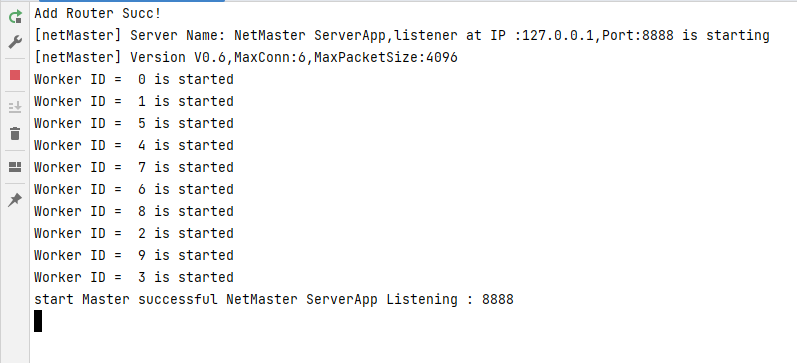
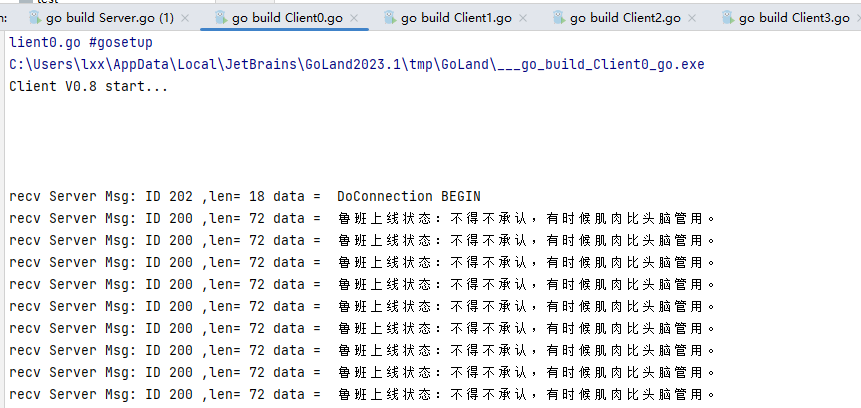

## 框架结构

### DemoV1.0

> V1.0是根据编写的TCP网络框架，所设定的基于终端的Client与Server，通过文字来模拟王者荣耀的进房间机制
> 具体流程
> 每一个玩家选择一个游戏角色的ID比如鲁班ID为0
> 客户端：向Server发送鲁班上线的请求，死循环2秒发送一个
> 服务端；接受到Client的请求后，
> 根据信息里的消息类型进行路由分发，选择合适的路由，并对其进行返回进入房间后鲁班的口头禅，
> 比如：得不承认，有时候肌肉比头脑管用。

> 每个玩家断开连接前后，通过Hook函数对消息进行提醒，进入房间或者退出房间

### TCP监听

### TCP捕获链接，进入是进行广播

### TCP 接收到远程的退出

### Client 接受来自服务器的信息

