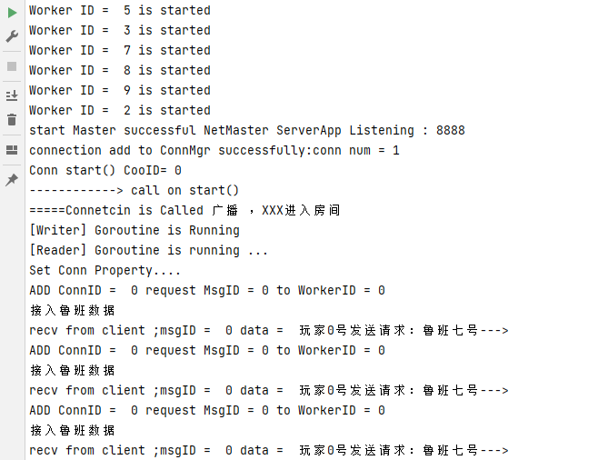

# NetMaster
TCP网络服务框架

- TLV格式数据包防止基于流的套接字出现粘包问题
- 提供数据打包和数据解包为二进制流的机制
- 读写分离，读来自Client的请求与Write请求，使用不同的goroutine
- 使用工作池与消息队列（map实现）的方式进行处理，减少大量请求下的资源问题
- 提供路由注册管理机制，用户根据发送数据的类型，定制对应类型的相应方式
- 抽象与实现分离，格式清晰 
### 提供demo进行测试验证
### DemoV1.0

> V1.0是根据编写的TCP网络框架，所设定的基于终端的Client与Server，通过文字来模拟王者荣耀的进房间机制
> 具体流程
> 每一个玩家选择一个游戏角色的ID比如鲁班ID为0
> 客户端：向Server发送鲁班上线的请求，死循环2秒发送一个
> 服务端；接受到Client的请求后，
> 根据信息里的消息类型进行路由分发，选择合适的路由，并对其进行返回进入房间后鲁班的口头禅，
> 比如：得不承认，有时候肌肉比头脑管用。

> 每个玩家断开连接前后，通过Hook函数对消息进行提醒，进入房间或者退出房间

### TLV包

### TCP监听

### TCP捕获链接，进入是进行广播

### TCP 接收到远程的退出

### Client 接受来自服务器的信息

